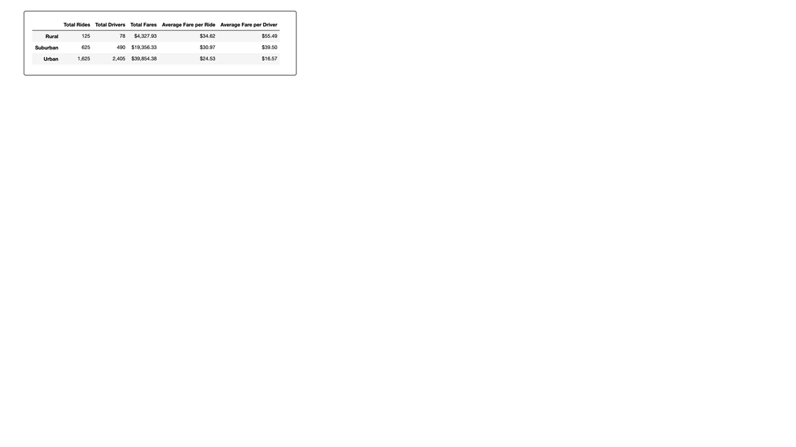

# PyBer_Analysis
# PyBer_Challenge

We analyzed the PyBer data to understand the differences in revenue per ride and driver for different types of areas (urban, suburban, 
rural).  We want to optimize the revenue at PyBer.
I used python and pandas in a jupyter notebook to analyze the data.  I used Matplotlib to create graphics.  We needed to limit the data to rides between January
and April, then used the resample function to look at the totals by week.
There was some reformmating.  We created a dataframe and indexed on time.  Then re-indexed on type.

## Technical Analysis Deliverable 1: A DataFrame that summarizes the key metrics for the ride-sharing data by city type.

Drivers make more money per ride in rural areas.  Fares per ride cost more in rural areas.  But there are far fewer total rides in rural areas.
Most of the PyBer's money is made in the Urban areas.

## Technical Analysis Deliverable 2: A multiple-line chart, with one line for each city type, that shows the sum of the fares for each week.

Fares are pretty constant from January to April.  Urban rides have greater volume followed by suburban and then rural.

Some challenges:  creating the dataframe and resampling.  I did some reading on resampling.  also, getting the graphics to appear in
the readme file.  Not sure this is working.

## Delivering Results: A written report of your results, saved in a README.md document on your GitHub repository.
You are reading it.
 
